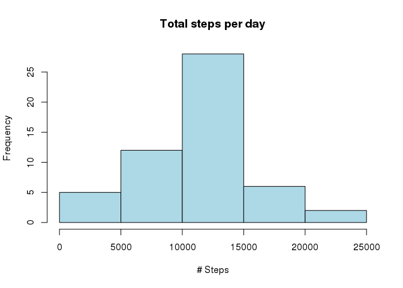
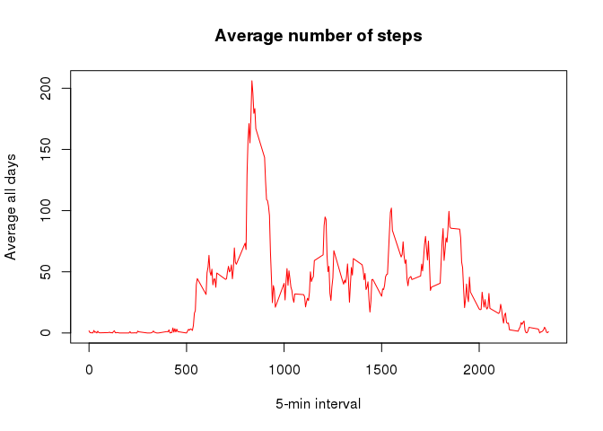
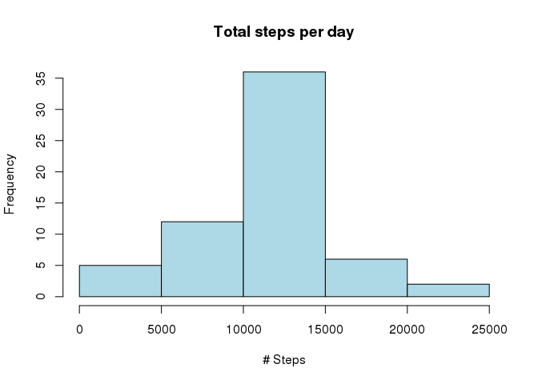
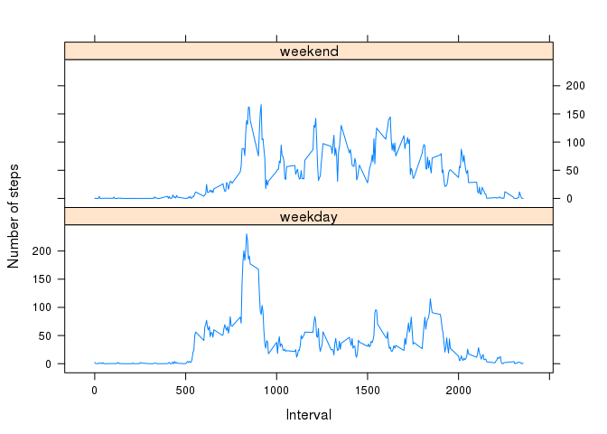

# Reproducible Research: Peer Assessment 1

# Reproducible Research: Peer Assessment 1
John Letteboer

## Loading and preprocessing the data
##### 1. Load the data 

```r
activity <- read.csv(unz("activity.zip", "activity.csv"))
head(activity)
```

```
##   steps       date interval
## 1    NA 2012-10-01        0
## 2    NA 2012-10-01        5
## 3    NA 2012-10-01       10
## 4    NA 2012-10-01       15
## 5    NA 2012-10-01       20
## 6    NA 2012-10-01       25
```

##### 2. Process/transform the data

```r
activity$date <- as.Date(activity$date, "%Y-%m-%d")
```

## What is mean total number of steps taken per day?
##### 1. Calculate the total number of steps taken per day.

```r
agg <- aggregate(steps ~ date, activity, sum)
head(agg)
```

```
##         date steps
## 1 2012-10-02   126
## 2 2012-10-03 11352
## 3 2012-10-04 12116
## 4 2012-10-05 13294
## 5 2012-10-06 15420
## 6 2012-10-07 11015
```

##### 2. Make a histogram of the total number of steps taken each day

```r
hist(agg$steps, 
     col = "lightblue", 
     xlab = "# Steps", 
     main = "Total steps per day")
```

 

##### 3. Calculate and report the mean and median of the total number of steps taken per day

```r
mean(agg$steps)
```

```
## [1] 10766.19
```

```r
median(agg$steps)
```

```
## [1] 10765
```

## What is the average daily activity pattern?
##### 1. Make a time series plot (i.e. type = "l") of the 5-minute interval (x-axis) and the average number of steps taken, averaged across all days (y-axis)

```r
#ts <- tapply(activity$steps, activity$interval, mean, na.rm = TRUE)
ts <- aggregate(steps ~ interval, activity, mean)
plot(ts, type = "l", 
     col = "red",
     xlab = "5-min interval", 
     ylab = "Average all days", 
     main = "Average number of steps")
```

 

##### 2. Which 5-minute interval, on average across all the days in the dataset, contains the maximum number of steps?

```r
ts_max <- ts[ts$steps==max(ts$steps),]
```

The 5-minute interval with the maximum number of steps is **835** and the maximum number of steps is **206** (rounded).

## Imputing missing values
##### 1. Calculate and report the total number of missing values in the dataset (i.e. the total number of rows with NAs)

```r
summary(activity$steps)["NA's"]
```

```
## NA's 
## 2304
```

##### 2. Devise a strategy for filling in all of the missing values in the dataset. The strategy does not need to be sophisticated. For example, you could use the mean/median for that day, or the mean for that 5-minute interval, etc.

My stategy for filling in all of the missing values is the mean for that 5-minute interval.

##### 3. Create a new dataset that is equal to the original dataset but with the missing data filled in.

```r
activity1 <- activity
agg1 <- aggregate(steps ~ interval, activity1, mean)
index <- which(is.na(activity1$steps))
activity1$steps[index] <- agg1$steps[as.factor(activity1$interval[index])]
```

##### 4. Make a histogram of the total number of steps taken each day and Calculate and report the mean and median total number of steps taken per day. Do these values differ from the estimates from the first part of the assignment? What is the impact of imputing missing data on the estimates of the total daily number of steps?

```r
agg2 <- aggregate(steps ~ date, activity1, sum)
hist(agg2$steps, 
     col = "lightblue", 
     xlab = "# Steps", 
     main = "Total steps per day")
```

 

The mean and median are:

```r
mean(agg2$steps)
```

```
## [1] 10766.19
```

```r
median(agg2$steps)
```

```
## [1] 10766.19
```

What is the difference with part 1 of this assignment is:

```r
mean(agg2$steps) - mean(agg$steps)
```

```
## [1] 0
```

```r
median(agg2$steps) - median(agg$steps)
```

```
## [1] 1.188679
```

## Are there differences in activity patterns between weekdays and weekends?
##### 1. Create a new factor variable in the dataset with two levels – “weekday” and “weekend” indicating whether a given date is a weekday or weekend day.

```r
activity2 <- activity1
weekend <- weekdays(activity2$date) %in% c("Saturday", "Sunday")
activity2$daytype <- "weekday"
activity2$daytype[weekend == TRUE] <- "weekend"
activity2$daytype <- as.factor(activity2$daytype)
str(activity2)
```

```
## 'data.frame':	17568 obs. of  4 variables:
##  $ steps   : num  1.717 0.3396 0.1321 0.1509 0.0755 ...
##  $ date    : Date, format: "2012-10-01" "2012-10-01" ...
##  $ interval: int  0 5 10 15 20 25 30 35 40 45 ...
##  $ daytype : Factor w/ 2 levels "weekday","weekend": 1 1 1 1 1 1 1 1 1 1 ...
```

##### 2. Make a panel plot containing a time series plot (i.e. type = "l") of the 5-minute interval (x-axis) and the average number of steps taken, averaged across all weekday days or weekend days (y-axis). See the README file in the GitHub repository to see an example of what this plot should look like using simulated data.

```r
library(lattice)
agg3 <- aggregate(steps ~ interval + daytype, data = activity2, mean)
xyplot(steps ~ interval | daytype, 
       agg3, type = "l", 
       layout = c(1, 2), 
       xlab = "Interval", 
       ylab = "Number of steps")
```

 

