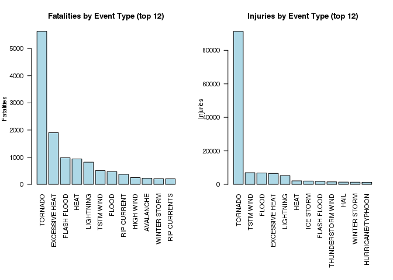
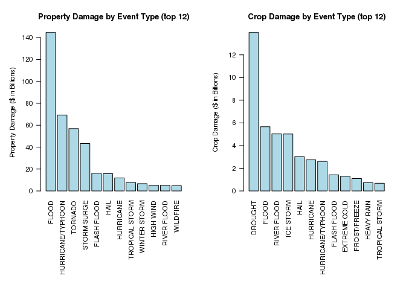

# Reproducible Research - Peer Assessment 2
John Letteboer  
11/20/2015  

## Storms and other severe weather events on public health and economic in the United States

### Synopsis
In this report we aim to describe which types of events (as indicated in the EVTYPE variable) are most harmful with respect to population health and have the greatest economic consequences across the United States. The events in the database start in the year 1950 and end in November 2011.

Our overall hypothesis address the following questions:

1. Across the United States, which types of events (as indicated in the EVTYPE variable) are most harmful with respect to population health?
2. Across the United States, which types of events have the greatest economic consequences?

From these data, we found that, the most damaging weather event in terms of FATALITIES and INJURIES is "TORNADO". When it comes to greatest economic consequences in terms of properties and crops, "FLOOD" is the most damaging to properties and "DROUGHT" is the most damaging to Crops.

### Data Processing
First we need to download and load the data into R. First part of the code we load al necessaries libraries. Second part is a check, before downloading, if the file we want to download already exists. Third part is read the data into a object type.


```r
## Loading the necessaries libraries
library(knitr)

## Download the storm data from NOAA
if (!file.exists("repdata-data-StormData.csv.bz2")) {
    download.file("https://d396qusza40orc.cloudfront.net/repdata%2Fdata%2FStormData.csv.bz2", "repdata-data-StormData.csv.bz2", method="libcurl")
}

## Load the storm data into variable 'stormData'
df <- read.csv("repdata-data-StormData.csv.bz2")
class(df)
```

```
## [1] "data.frame"
```

Now we have load the data into a data frame object. Let’s take a look at the data we have loaded.


```r
dim(df)
```

```
## [1] 902297     37
```

```r
names(df)
```

```
##  [1] "STATE__"    "BGN_DATE"   "BGN_TIME"   "TIME_ZONE"  "COUNTY"    
##  [6] "COUNTYNAME" "STATE"      "EVTYPE"     "BGN_RANGE"  "BGN_AZI"   
## [11] "BGN_LOCATI" "END_DATE"   "END_TIME"   "COUNTY_END" "COUNTYENDN"
## [16] "END_RANGE"  "END_AZI"    "END_LOCATI" "LENGTH"     "WIDTH"     
## [21] "F"          "MAG"        "FATALITIES" "INJURIES"   "PROPDMG"   
## [26] "PROPDMGEXP" "CROPDMG"    "CROPDMGEXP" "WFO"        "STATEOFFIC"
## [31] "ZONENAMES"  "LATITUDE"   "LONGITUDE"  "LATITUDE_E" "LONGITUDE_"
## [36] "REMARKS"    "REFNUM"
```

```r
head(df, 3)
```

```
##   STATE__          BGN_DATE BGN_TIME TIME_ZONE COUNTY COUNTYNAME STATE
## 1       1 4/18/1950 0:00:00     0130       CST     97     MOBILE    AL
## 2       1 4/18/1950 0:00:00     0145       CST      3    BALDWIN    AL
## 3       1 2/20/1951 0:00:00     1600       CST     57    FAYETTE    AL
##    EVTYPE BGN_RANGE BGN_AZI BGN_LOCATI END_DATE END_TIME COUNTY_END
## 1 TORNADO         0                                               0
## 2 TORNADO         0                                               0
## 3 TORNADO         0                                               0
##   COUNTYENDN END_RANGE END_AZI END_LOCATI LENGTH WIDTH F MAG FATALITIES
## 1         NA         0                      14.0   100 3   0          0
## 2         NA         0                       2.0   150 2   0          0
## 3         NA         0                       0.1   123 2   0          0
##   INJURIES PROPDMG PROPDMGEXP CROPDMG CROPDMGEXP WFO STATEOFFIC ZONENAMES
## 1       15    25.0          K       0                                    
## 2        0     2.5          K       0                                    
## 3        2    25.0          K       0                                    
##   LATITUDE LONGITUDE LATITUDE_E LONGITUDE_ REMARKS REFNUM
## 1     3040      8812       3051       8806              1
## 2     3042      8755          0          0              2
## 3     3340      8742          0          0              3
```

As we can see we have 902297 observations and 37 variables and all colomns have names.

According to the documentation of the database, there are 7 variables related to these questions:

- `EVTYPE` as a measure of event type (e.g. tornado, flood, etc.)
- `FATALITIES` as a measure of harm to human health
- `INJURIES` as a measure of harm to human health
- `PROPDMG` as a measure of property damage and hence economic damage in USD
- `PROPDMGEXP` as a measure of magnitude of property damage (e.g. thousands, millions USD, etc.)
- `CROPDMG` as a measure of crop damage and hence economic damage in USD
- `CROPDMGEXP` as a measure of magnitude of crop damage (e.g. thousands, millions USD, etc.)

Therefore, we create a two new data frames, `q1` and `q2`, with some of these 7 variables.

#### Prepare data for Question 1
1. Across the United States, which types of events (as indicated in the `EVTYPE` variable) are most harmful with respect to population health?

For this question we do not need the complete dataset, therefore we create a subset for this analysis and it's a lot faster exploration of the data than the complete dataset. We only need the variables `FATALITIES`, `INJURIES` and `EVTYPE` because we are answering which types of events (as indicated in the `EVTYPE` variable) are most harmful with respect to population health.

Create a subset for question 1 (`q1`).

```r
q1 <- subset(df, select=c("FATALITIES","INJURIES","EVTYPE"))
```

Aggregrate `FATALITIES` and `INJURIES` by `EVTYP` with the `FUN` is `sum`.

```r
fatalities <- aggregate(FATALITIES ~ EVTYPE, q1, sum)
injuries <- aggregate(INJURIES ~ EVTYPE, q1, sum)
```

Descending order and get only top 12 else the list is to long.

```r
fatal_ord <- head(fatalities[order(-fatalities$FATALITIES),], 12)
injur_ord <- head(injuries[order(-injuries$INJURIES),], 12)
```

Show ordered data.

```r
fatal_ord
```

```
##             EVTYPE FATALITIES
## 834        TORNADO       5633
## 130 EXCESSIVE HEAT       1903
## 153    FLASH FLOOD        978
## 275           HEAT        937
## 464      LIGHTNING        816
## 856      TSTM WIND        504
## 170          FLOOD        470
## 585    RIP CURRENT        368
## 359      HIGH WIND        248
## 19       AVALANCHE        224
## 972   WINTER STORM        206
## 586   RIP CURRENTS        204
```

```r
injur_ord
```

```
##                EVTYPE INJURIES
## 834           TORNADO    91346
## 856         TSTM WIND     6957
## 170             FLOOD     6789
## 130    EXCESSIVE HEAT     6525
## 464         LIGHTNING     5230
## 275              HEAT     2100
## 427         ICE STORM     1975
## 153       FLASH FLOOD     1777
## 760 THUNDERSTORM WIND     1488
## 244              HAIL     1361
## 972      WINTER STORM     1321
## 411 HURRICANE/TYPHOON     1275
```

#### Prepare data for Question 2
2. Across the United States, which types of events have the greatest economic consequences?

For this question we also do not need the complete dataset, therefore we create a different subset for this analysis and it's a lot faster exploration of the data than the complete dataset. We need the variables `EVTYPE`, `PROPDMG`, `PROPDMGEXP`, `CROPDMG` and `CROPDMGEXP` because we are answering which types of events have the greatest economic consequences.

Create a subset for question 2 (`q2`).

```r
q2 <- subset(df, select=c("EVTYPE", "PROPDMG", "PROPDMGEXP", "CROPDMG", "CROPDMGEXP" ))
```

**Note**: EXP = exponent

What are possible values of `CROPDMGEXP` and `PROPDMGEXP`.

```r
unique(q2$PROPDMGEXP)
```

```
##  [1] K M   B m + 0 5 6 ? 4 2 3 h 7 H - 1 8
## Levels:  - ? + 0 1 2 3 4 5 6 7 8 B h H K m M
```

```r
unique(q2$CROPDMGEXP)
```

```
## [1]   M K m B ? 0 k 2
## Levels:  ? 0 2 B k K m M
```

As we can see the possible values are: `- ? + 0 1 2 3 4 5 6 7 8 B h H K k m M, and blanks`. We only know the values for these variables:

- H,h = hundreds = 100
- K,k = kilos = thousands = 1,000
- M,m = millions = 1,000,000
- B,b = billions = 1,000,000,000

Convert these known values to numeric so we can calculate property and crop damage. We are multiplying `PROPDMG` with `PROPDMGEXP` and `CROPDMG` with `CROPDMGEXP`.

```r
q2$PROP_DAMAGE <- 0
q2[toupper(q2$PROPDMGEXP) == "H",]$PROP_DAMAGE <- q2[toupper(q2$PROPDMGEXP) == "H",]$PROPDMG * 10^2
q2[toupper(q2$PROPDMGEXP) == "K",]$PROP_DAMAGE <- q2[toupper(q2$PROPDMGEXP) == "K",]$PROPDMG * 10^3
q2[toupper(q2$PROPDMGEXP) == "M",]$PROP_DAMAGE <- q2[toupper(q2$PROPDMGEXP) == "M",]$PROPDMG * 10^6
q2[toupper(q2$PROPDMGEXP) == "B",]$PROP_DAMAGE <- q2[toupper(q2$PROPDMGEXP) == "B",]$PROPDMG * 10^9

q2$CROP_DAMAGE <- 0
q2[toupper(q2$CROPDMGEXP) == "H",]$CROP_DAMAGE <- q2[toupper(q2$CROPDMGEXP) == "H",]$CROPDMG * 10^2
q2[toupper(q2$CROPDMGEXP) == "K",]$CROP_DAMAGE <- q2[toupper(q2$CROPDMGEXP) == "K",]$CROPDMG * 10^3
q2[toupper(q2$CROPDMGEXP) == "M",]$CROP_DAMAGE <- q2[toupper(q2$CROPDMGEXP) == "M",]$CROPDMG * 10^6
q2[toupper(q2$CROPDMGEXP) == "B",]$CROP_DAMAGE <- q2[toupper(q2$CROPDMGEXP) == "B",]$CROPDMG * 10^9
```

Let's check if the calculate columns are numeric.

```r
class(q2$PROP_DAMAGE)
```

```
## [1] "numeric"
```

```r
class(q2$CROP_DAMAGE)
```

```
## [1] "numeric"
```

As we can see the new columns `PROP_DAMAGE` and `CROP_DAMAGE` are of a numeric class, now we can create an aggregration.

```r
prop_damages <- aggregate(PROP_DAMAGE ~ EVTYPE, q2, sum)
crop_damages <- aggregate(CROP_DAMAGE ~ EVTYPE, q2, sum)
```

Descending order and get only top 12 else the list is to long:

```r
prop_dam_ord <- head(prop_damages[order(-prop_damages$PROP_DAMAGE),], 12)
crop_dam_ord <- head(crop_damages[order(-crop_damages$CROP_DAMAGE),], 12)
```

Show ordered data:

```r
prop_dam_ord
```

```
##                EVTYPE  PROP_DAMAGE
## 170             FLOOD 144657709800
## 411 HURRICANE/TYPHOON  69305840000
## 834           TORNADO  56937160480
## 670       STORM SURGE  43323536000
## 153       FLASH FLOOD  16140811510
## 244              HAIL  15732267220
## 402         HURRICANE  11868319010
## 848    TROPICAL STORM   7703890550
## 972      WINTER STORM   6688497250
## 359         HIGH WIND   5270046260
## 590       RIVER FLOOD   5118945500
## 957          WILDFIRE   4765114000
```

```r
crop_dam_ord
```

```
##                EVTYPE CROP_DAMAGE
## 95            DROUGHT 13972566000
## 170             FLOOD  5661968450
## 590       RIVER FLOOD  5029459000
## 427         ICE STORM  5022113500
## 244              HAIL  3025954450
## 402         HURRICANE  2741910000
## 411 HURRICANE/TYPHOON  2607872800
## 153       FLASH FLOOD  1421317100
## 140      EXTREME COLD  1292973000
## 212      FROST/FREEZE  1094086000
## 290        HEAVY RAIN   733399800
## 848    TROPICAL STORM   678346000
```

### Results 

#### The results of question 1

Let's plot the data we created for question 1 into a barplot.

```r
par(mfrow=c(1,2), cex = 0.7, mar=c(12,4,4,2), las = 2)
barplot(
    fatal_ord$FATALITIES,
    names.arg = fatal_ord$EVTYPE,
    ylab = "Fatalities",
    main = "Fatalities by Event Type (top 12)",
    col = "lightblue"
)
barplot(
    injur_ord$INJURIES,
    names.arg = injur_ord$EVTYPE,
    ylab = "Injuries",
    main = "Injuries by Event Type (top 12)",
    col = "lightblue"
)
```

 

As we can see the most damage terms of fatalities and injuries is `Tornado`.

#### The results of question 2

Let's plot the data we created for question 2 into a barplot.


```r
# disable scientific notation 
options(scipen=999)

par(mfrow=c(1,2), cex = 0.7, mar=c(12,5,4,2), las = 2)
barplot(
    prop_dam_ord$PROP_DAMAGE/10^9,
    names.arg = prop_dam_ord$EVTYPE,
    ylab = "Property Damage ($ in Billions)",
    main = "Property Damage by Event Type (top 12)",
    col = "lightblue"
)
barplot(
    crop_dam_ord$CROP_DAMAGE/10^9,
    names.arg = crop_dam_ord$EVTYPE,
    ylab = "Crop Damage ($ in Billions)",
    main = "Crop Damage by Event Type (top 12)",
    col = "lightblue"
)
```

 

As we can see, "FLOOD" is the most damaging to properties and "DROUGHT" is the most damaging to Crops.
